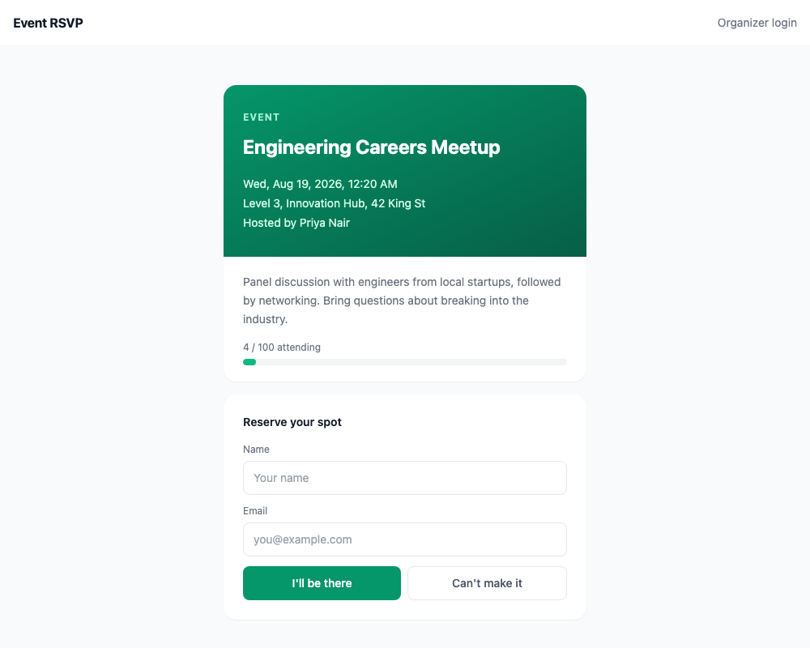
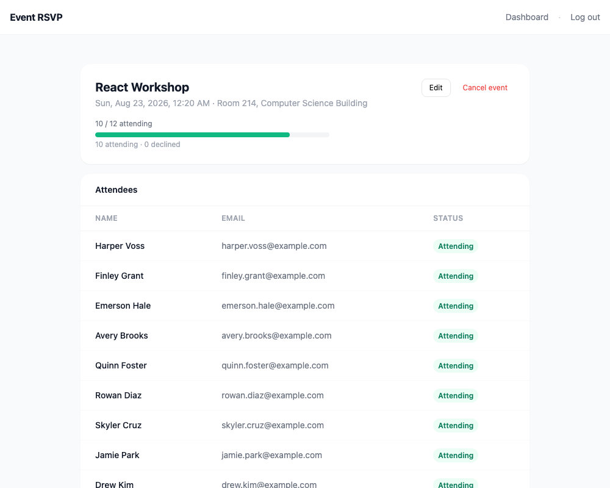
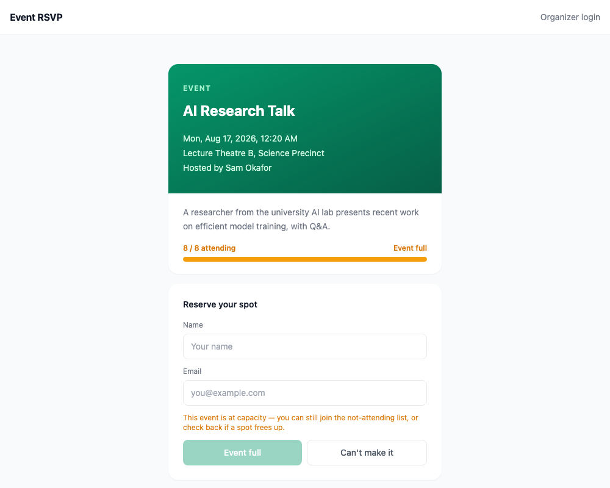
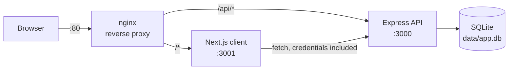
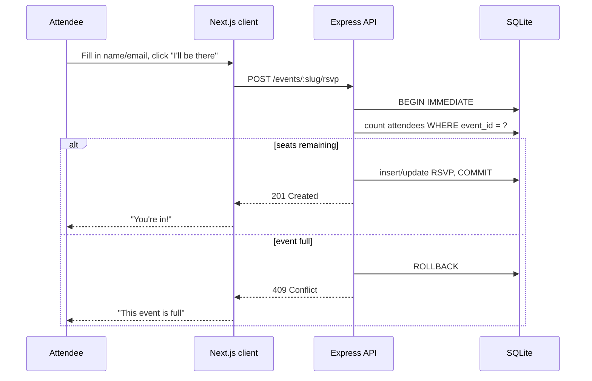
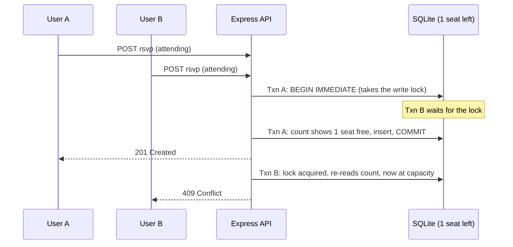
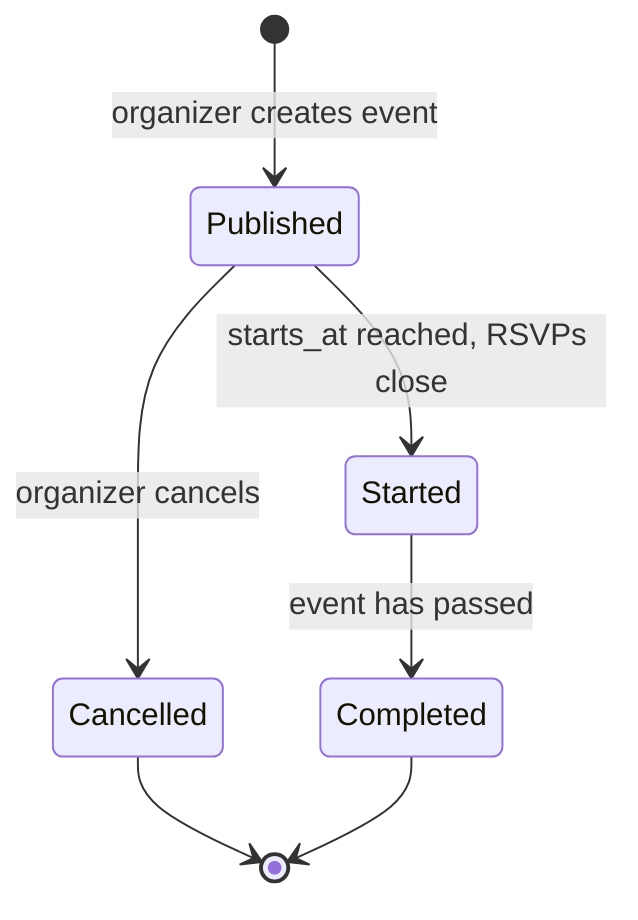

# Event RSVP

A small full-stack app for running RSVPs on a real event: an organizer creates an event with a capacity, attendees say whether they're coming, and the numbers stay correct even when two people try to grab the last spot at the same time. Built for the scale of a university society, a company meetup, or a workshop, not a ticketing platform.

<p align="center">
  
</p>

## More screenshots

<table>
<tr>
<td width="50%"></td>
<td width="50%"></td>
</tr>
<tr>
<td>Organizer dashboard: capacity, attendee list, edit and cancel controls.</td>
<td>An event at capacity. The RSVP button disables instead of accepting a request the database would reject anyway.</td>
</tr>
</table>

## Product workflow

An organizer registers, creates an event with a title, description, location, start time, and capacity, and shares the event's link. Attendees open that link, see the current attendance and remaining capacity, and RSVP with their name and email, no account needed. The organizer's dashboard shows who's coming, who's declined, and how close the event is to full, and lets them edit the event or cancel it outright.

## Architecture



Two containers behind nginx on one EC2 instance: a Next.js (Pages Router) client and an Express API, backed by a single SQLite file. No separate database service, no message queue, no service mesh, it's a monolith and stays one on purpose (see [ADR 3](docs/adr/0003-modular-monolith.md)).

GitHub Actions builds both Docker images on every push to `main`, ships them to the EC2 instance over SSH, and runs a health check after restarting the containers.

## RSVP and capacity correctness

The core guarantee: an event with capacity 100 never ends up with 101 confirmed attendees, no matter how the requests are timed.



`BEGIN IMMEDIATE` takes SQLite's write lock at the start of the transaction rather than when the first write runs, which is what actually closes the race. Here's the scenario that matters, with one seat left and two attendees RSVPing at nearly the same instant:



Txn B doesn't see the stale "1 seat free" that existed when its request arrived; it sees whatever Txn A actually left behind, because it couldn't proceed until Txn A committed. This is tested directly in `test/rsvp.test.js`, which fires two RSVP requests concurrently at a one-seat event and asserts on the exact pair of response codes.

Full reasoning, including why SQLite over Postgres for this project, in [ADR 1](docs/adr/0001-sqlite-for-capacity-enforcement.md). Specific edge cases (organizer lowers capacity below attendance, event starts mid-RSVP, response lost after a successful write) are written up in [docs/engineering-notes.md](docs/engineering-notes.md).

## Event lifecycle



## Application structure

```
server/
  app.js            Express app wiring: middleware, routes, error handler
  db.js             SQLite connection, pragmas, schema bootstrap
  schema.sql         Single schema file, applied idempotently on boot
  routes/            auth.js, events.js, rsvps.js
  middleware/auth.js Session cookie -> req.user
  lib/               errors.js, time.js, slug.js, pagination.js
  seed.js            Deterministic demo data

client/
  pages/             Next.js Pages Router: /, /events/[slug], /login,
                      /register, /dashboard, /dashboard/new, /dashboard/[slug]
  components/        CapacityBar, EventCard, RsvpPanel, Layout
  context/           AuthContext (organizer session state)
  lib/               api.js (fetch wrapper), format.js (timezone display),
                      useIdentity.js (remembered attendee name/email)

test/                node:test + supertest, against an in-memory database
docs/adr/            Architectural decisions
docs/engineering-notes.md   Specific failure scenarios and what happens
```

## API overview

| Method | Path | Auth | Notes |
|---|---|---|---|
| `GET` | `/api/events` | none | Published, upcoming events, paginated |
| `POST` | `/api/events` | organizer | Create an event |
| `GET` | `/api/events/mine` | organizer | Events you organize, any status |
| `GET` | `/api/events/:slug` | none | Event detail with live attendance count |
| `PATCH` | `/api/events/:slug` | organizer, owner | Rejects capacity below current attendance (`409`) |
| `DELETE` | `/api/events/:slug` | organizer, owner | Soft-cancels; RSVPs are preserved |
| `GET` | `/api/events/:slug/attendees` | organizer, owner | Paginated attendee list |
| `GET` | `/api/events/:slug/rsvp?email=` | none | Look up an existing RSVP by email |
| `POST` | `/api/events/:slug/rsvp` | none | Idempotent upsert; `201` on create, `200` on update, `409` if full |
| `DELETE` | `/api/events/:slug/rsvp` | none | Remove an RSVP by email |
| `POST` | `/api/auth/register` \| `/login` \| `/logout` | — | Organizer accounts, bcrypt + server-side sessions |

Errors return `{ "error": "message" }` with an intentional status code: `422` for validation, `401`/`403` for auth, `404` for missing resources, `409` for a legitimate conflict (full event, cancelled event, capacity below attendance). Anything unexpected is logged server-side and returned as a generic `500`, never with an internal error message attached.

## Database design

```
users            id, name, email (unique), password_hash, created_at
sessions         token (pk), user_id -> users, expires_at
events           id, organizer_id -> users, slug (unique), title, description,
                 location, starts_at, ends_at, capacity, status, created_at, updated_at
rsvps            id, event_id -> events, name, email, status, created_at, updated_at
                 UNIQUE (event_id, email)
```

Indexes exist where an actual query pattern needs one: `events(organizer_id)` for "events I organize," `events(starts_at)` for the upcoming-events list, and the `rsvps(event_id, email)` unique constraint doubles as the index for "does this attendee already have an RSVP." Nothing is indexed on the theory that it might be useful someday.

`events.capacity` has a `CHECK (capacity > 0)` constraint. `rsvps.status` and `events.status` are constrained to their valid enum values at the schema level, not just validated in JavaScript.

## Running locally

```bash
# API
npm install
npm run seed      # demo organizers, events, and RSVPs
npm run dev        # http://localhost:3000

# Client, in another terminal
cd client
cp .env.example .env.local
npm install
npm run dev         # http://localhost:3001
```

Seeded organizer logins: `priya@example.com` / `sam@example.com`, password `password123`.

## Tests

```bash
npm test
```

`node:test` and `supertest` against the real Express app wired to an in-memory SQLite database, no mocking of the database layer. Covers: create-and-RSVP flow, duplicate RSVP idempotency, capacity rejection, the concurrent final-slot race, organizer authorization, capacity-lowering rejection, and RSVP cancellation freeing a slot. 21 tests, all behavioral, no coverage-percentage target.

## Engineering decisions

- [ADR 1: SQLite, and enforcing capacity inside a transaction](docs/adr/0001-sqlite-for-capacity-enforcement.md)
- [ADR 2: RSVP uniqueness enforced at the database level](docs/adr/0002-rsvp-uniqueness.md)
- [ADR 3: Stay a monolith](docs/adr/0003-modular-monolith.md)
- [ADR 4: Store UTC, convert at the client](docs/adr/0004-timezone-strategy.md)
- [ADR 5: Attendees identify by email, not by account](docs/adr/0005-attendee-identity-by-email.md)
- [ADR 6: Organizer auth: server-side sessions, not JWT](docs/adr/0006-session-auth.md)
- [Engineering notes: specific failure scenarios](docs/engineering-notes.md)

## Deliberate limitations

- **Attendees aren't authenticated.** Modifying an RSVP requires knowing the email it was made with, not a login. Reasonable for a low-stakes event RSVP, not something to build on for anything higher-stakes. ([ADR 5](docs/adr/0005-attendee-identity-by-email.md))
- **One SQLite file.** Correct and simple for one API process; would need to move to Postgres if this ever ran as multiple API instances behind a load balancer. ([ADR 1](docs/adr/0001-sqlite-for-capacity-enforcement.md))
- **No explicit per-event timezone field.** Event time is inferred from the organizer's browser at creation time. Correct for single-location or single-timezone-audience events, not for something aimed at a genuinely global audience. ([ADR 4](docs/adr/0004-timezone-strategy.md))
- **No email notifications, waitlists, or check-in.** Not built because they're not needed to demonstrate the parts of this project that are actually interesting, not because they were forgotten.

## Infrastructure

- AWS EC2 (t3.micro, Ubuntu), Docker containers with `--restart unless-stopped`
- nginx: reverse proxy, gzip, security headers
- GitHub Actions: build both images on push to `main`, ship over SSH, restart containers, health check
- IAM least-privilege, security groups scoped to the ports actually in use, SSH key auth, secrets in GitHub Actions Secrets
